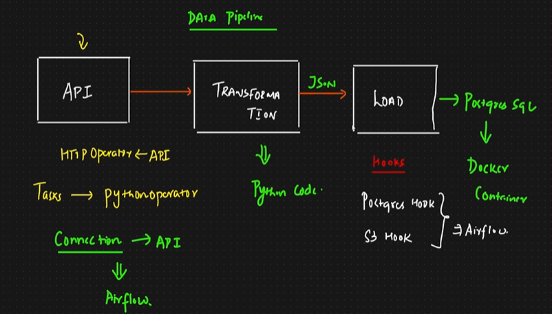

### Project Overview: Airflow ETL Pipeline with Postgres and API Integration
This project involves creating an ETL (Extract, Transform, Load) pipeline using Apache Airflow. The pipeline extracts data from an external API (in this case, NASA's Astronomy Picture of the Day (APOD) API), transforms the data, and loads it into a Postgres database. The entire workflow is orchestrated by Airflow, a platform that allows scheduling, monitoring, and managing workflows.

The project leverages Docker to run Airflow and Postgres as services, ensuring an isolated and reproducible environment. We also utilize Airflow hooks and operators to handle the ETL process efficiently.

### Architecture:



Key Components of the Project:
Airflow for Orchestration:

Airflow is used to define, schedule, and monitor the entire ETL pipeline. It manages task dependencies, ensuring that the process runs sequentially and reliably.
The Airflow DAG (Directed Acyclic Graph) defines the workflow, which includes tasks like data extraction, transformation, and loading.
Postgres Database:

A PostgreSQL database is used to store the extracted and transformed data.
Postgres is hosted in a Docker container, making it easy to manage and ensuring data persistence through Docker volumes.
We interact with Postgres using Airflow’s PostgresHook and PostgresOperator.
NASA API (Astronomy Picture of the Day):

The external API used in this project is NASA’s APOD API, which provides data about the astronomy picture of the day, including metadata like the title, explanation, and the URL of the image.
We use Airflow’s SimpleHttpOperator to extract data from the API.
Objectives of the Project:
Extract Data:

The pipeline extracts astronomy-related data from NASA’s APOD API on a scheduled basis (daily, in this case).
Transform Data:

Transformations such as filtering or processing the API response are performed to ensure that the data is in a suitable format before being inserted into the database.
Load Data into Postgres:

The transformed data is loaded into a Postgres database. The data can be used for further analysis, reporting, or visualization.
Architecture and Workflow:
The ETL pipeline is orchestrated in Airflow using a DAG (Directed Acyclic Graph). The pipeline consists of the following stages:

1. Extract (E):
The SimpleHttpOperator is used to make HTTP GET requests to NASA’s APOD API.
The response is in JSON format, containing fields like the title of the picture, the explanation, and the URL to the image.
2. Transform (T):
The extracted JSON data is processed in the transform task using Airflow’s TaskFlow API (with the @task decorator).
This stage involves extracting relevant fields like title, explanation, url, and date and ensuring they are in the correct format for the database.
3. Load (L):
The transformed data is loaded into a Postgres table using PostgresHook.
If the target table doesn’t exist in the Postgres database, it is created automatically as part of the DAG using a create table task.

---

## How to Run This Project Step by Step

This section explains how to run the ETL pipeline and set up the required Airflow connections without changing the existing project content above.

### 1. Required Airflow Connections

Before running the DAG, create these two Airflow connections:

- `nasa_api`
- `my_postgres_connection`

These connection IDs must match the values used in [etl.py](../etl.py:1).

### 2. Start Docker and the Astro Project

First, make sure Docker Desktop is running.

Then start the project services:

```powershell
astro dev start
```

This should start the Airflow and PostgreSQL containers for the project.

After startup:

- Airflow should be available at `http://localhost:8080` (it may not work on windows)
- PostgreSQL should be available on port `5432`

### 3. Log In to Airflow

Open:

```text
http://localhost:8080
```

It the above address is not working then open it using containers from docker desktop.

Use the default credentials mentioned in the transcript:

- Username: `admin`
- Password: `admin`

### 4. Create the NASA API Connection

In the Airflow UI:

1. Go to `Admin`
2. Open `Connections`
3. Click the add connection option

Fill the connection with:

- Connection Id: `nasa_api`
- Connection Type: `HTTP`
- Host: `https://api.nasa.gov`

You do not need login or password here.

Add your NASA API key in the Extra field as JSON:

```json
{
  "api_key": "YOUR_NASA_API_KEY"
}
```

This is required because the DAG reads the key from the Airflow connection extras.

### 5. Create the PostgreSQL Connection

Create a second Airflow connection with:

- Connection Id: `my_postgres_connection`
- Connection Type: `Postgres`
- Host: `postgres_db`
- Schema/Database: `postgres`
- Login: `postgres`
- Password: `postgres`
- Port: `5432`

These values come from [docker.compose.yml](./docker.compose.yml:1).

Important note:

- Inside Airflow, use the Docker container host name
- In this project, the PostgreSQL container name is `postgres_db`

### 6. Open and Run the DAG

After both connections are created, go to the DAGs page and find:

- `nasa_apod_postgres`

This DAG is scheduled with `@daily`.

Run it manually from the Airflow UI to test the flow.

### 7. What the DAG Does

The pipeline runs these stages:

1. Create the `apod_data` table if it does not already exist
2. Extract APOD data from the NASA API
3. Transform the API response into the required fields
4. Load the transformed data into PostgreSQL

### 8. Validate the Run in Airflow

Once triggered, the tasks should turn green if the setup is correct.

Main tasks to check:

- `create_table`
- `extract_apod`
- `transform_apod_data`
- `load_data_to_postgres`

You can inspect:

- Task logs for execution details
- XCom output for extracted and transformed data

If the load step succeeds, the logs should show that rows were inserted.

### 9. Verify Data in PostgreSQL with DBeaver

To inspect the database, use DBeaver and create a PostgreSQL connection with:

- Host: `localhost`
- Port: `5432`
- Database: `postgres`
- Username: `postgres`
- Password: `postgres`

Use `localhost` here because DBeaver runs on your machine, not inside the Airflow container.

After connecting, open the `apod_data` table and run:

```sql
SELECT * FROM apod_data;
```

Each successful DAG run should insert a row into the table.

### 10. Stop the Services After Use

When you are done, stop the running project services:

```powershell
astro dev stop
```

### Quick Run Checklist

1. Start Docker Desktop
2. Run `astro dev start`
3. Open Airflow at `localhost:8080`
4. Create `nasa_api`
5. Create `my_postgres_connection`
6. Run `nasa_apod_postgres`
7. Verify records in DBeaver
8. Stop services with `astro dev stop`
